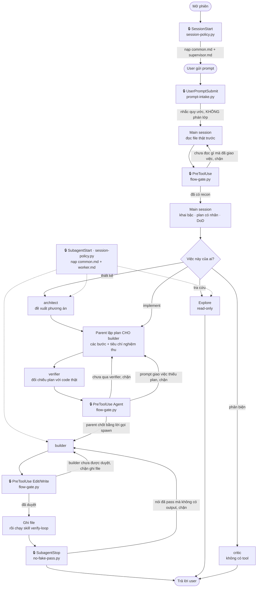

# agent-kit

Plugin cho Claude Code, gồm một bộ subagent và một vòng kiểm chứng. Mục đích là
buộc agent làm việc theo ba nguyên tắc:

- **Không bịa.** Mọi khẳng định phải có nguồn thật. Chỗ nào không tra được thì
  phải hiện ra là chưa rõ, không được lấp cho câu văn liền mạch.
- **Có mục tiêu.** Mỗi task phải có tiêu chí hoàn thành kiểm chứng được, và phải
  có điều kiện dừng để không lặp vô hạn.
- **Review lại.** Việc làm xong phải đi qua vòng verify (build, typecheck, lint,
  test) và qua cổng phản biện.

Phiên bản: **v1.0.2**. Profile: THOROUGH (siết chặt nhất).

## Cài đặt

Trong một phiên Claude Code:

```
/plugin marketplace add nhattamgithub1999/agent-kit
/plugin install agent-kit@agent-kit
```

Hoặc từ terminal:

```bash
claude plugin marketplace add nhattamgithub1999/agent-kit
claude plugin install agent-kit@agent-kit
```

Cài xong cần khởi động lại phiên để Claude Code nạp agent và hook.

## Nó giải quyết vấn đề gì

Năm kiểu sai mà một agent lập trình hay mắc, và trong bộ kit này mỗi kiểu có một
chốt chặn riêng:

| Kiểu sai | Trông như thế nào | Chốt chặn |
|---|---|---|
| Báo cáo khống | "Đã sửa xong, test pass hết" — nhưng chưa chạy lệnh test nào | `no-fake-pass.py` chặn lượt trả về nếu không kèm output thật |
| Nhảy vào code | Sửa file ngay từ câu đầu, chưa ai biết "xong" nghĩa là gì | `plan-gate.py` chặn lệnh ghi file khi phiên chưa có plan |
| Giao việc mù | Lập plan và gọi subagent khi chưa mở một file nào của repo | `flow-gate.py` chặn `Agent` và `ExitPlanMode` khi lượt này chưa đọc gì |
| Plan không có người làm | Plan liệt kê việc nhưng không ghi ai làm bước nào | `flow-gate.py` đối chiếu `subagent_type` với nhãn `[agent]` trích từ plan |
| Bỏ qua quy trình | Policy nằm trong `CLAUDE.md` ở quá xa nên lượt đầu quên mất | `session-policy.py` và `prompt-intake.py` đưa policy vào đúng chỗ, đúng lúc |

Điểm chung: chúng **không** phải lời khuyên viết trong prompt. Prompt chỉ làm giảm
xác suất. Bốn hook ở trên chặn thật bằng exit code, nên chúng là ràng buộc chứ
không phải khuyến nghị.

Ranh giới giữa "chặn thật" và "chỉ là chữ" được liệt kê tường minh ở cuối
`policy/supervisor.md`. Đọc mục đó trước khi tin rằng một luật nào đó tự giữ được.

## Luồng chạy bên trong plugin

Đây là vòng đời của một lượt làm việc. Ô có ổ khoá là hook — tức là chỗ plugin can
thiệp thật vào runtime, không phải chỗ nhắc nhở bằng chữ.



Đọc sơ đồ theo ba tầng:

1. **Trước khi nghĩ.** `session-policy.py` và `prompt-intake.py` đưa quy ước vào
   context. Cả hai chỉ *nhắc*; không cái nào phán prompt thuộc lớp nào.
2. **Trước khi giao việc.** `flow-gate.py` giữ cửa ra của điều phối: không đọc
   file thật thì không được lập plan hay gọi subagent, và gọi ai thì phải khớp
   nhãn plan đã ghi.
3. **Trước khi sửa và trước khi trả lời.** `plan-gate.py` giữ cửa ghi file;
   `verifier` giữ cửa vào `builder`; `no-fake-pass.py` soi lượt trả về của
   `builder`, chặn báo cáo pass không kèm output thật.

## Bên trong có gì

| Thành phần | Nội dung |
|---|---|
| `agents/` | Năm subagent: `Explore` (haiku), `architect` và `critic` (opus), `builder` và `verifier` (sonnet) |
| `hooks/` | Năm hook Python đang chạy, xem bảng ở mục dưới. `gloss-gate.py` còn trong thư mục nhưng đã gỡ khỏi `hooks.json` |
| `skills/verify-loop/` | Skill chạy vòng verify: build, typecheck, lint, test |
| `policy/common.md` | Luật áp cho mọi agent. Vào cả phiên chính lẫn subagent |
| `policy/supervisor.md` | Luật điều phối. Chỉ vào phiên chính |
| `policy/worker.md` | Luật thực thi. Chỉ vào subagent, không chứa bảng Routing |
| `VERIFICATION.template.md` | Mẫu để khai lệnh build/test của từng project |
| `glossary.example.txt` | File mẫu glossary. `verifier` tra file này khi đối chiếu nghĩa viết tắt |
| `optional/orchestrator.md` | Bản thay thế system prompt. Không bật mặc định |

### Năm subagent, mỗi cái một việc

| Agent | Dùng khi | Không dùng để |
|---|---|---|
| `Explore` | Tra cứu, tìm file, đọc hiểu hiện trạng | Sửa file, ra quyết định thiết kế |
| `architect` | Đề xuất phương án, so sánh trade-off | Tự sửa code |
| `builder` | Implement một thay đổi đã rõ phạm vi | Việc còn mơ hồ, hoặc cần quyết kiến trúc |
| `verifier` | Đối chiếu từng claim với codebase thật | Phản biện logic |
| `critic` | Phản biện độ chặt của lập luận | Sửa code |

Hai agent cuối là hai cổng chất lượng **khác nhau**, đừng dùng thay nhau.
`verifier` trả lời câu hỏi "thứ này có tồn tại không" nên nó có tool để đọc
codebase. `critic` trả lời câu hỏi "lập luận có chặt không" nên nó **không** có
tool, và chỉ được xem câu hỏi gốc cùng câu trả lời chứ không xem quá trình suy
luận — đó là điều giữ cho nó độc lập.

### Năm hook, năm chốt tất định

Prompt chỉ làm giảm xác suất agent làm sai. Hook mới là thứ chặn thật, bằng exit
code.

| Hook | Chạy lúc | Chặn cái gì |
|---|---|---|
| `session-policy.py` | Mở phiên, và mỗi khi một subagent khởi động | Policy bị bỏ qua vì plugin không đọc được `CLAUDE.md`. Phiên chính nhận luật điều phối, subagent nhận luật thực thi |
| `prompt-intake.py` | Người dùng gửi prompt | Quên quy ước vì policy đã ở quá xa trong context. Chỉ *nhắc*, không phán lớp |
| `flow-gate.py` | Trước `Read`/`Grep`/`Glob`/`Bash`/`Agent`/`ExitPlanMode`/`Edit`/`Write` | Lập plan hoặc giao việc khi lượt này chưa đọc file nào; giao việc bằng prompt cụt; gọi agent không khớp nhãn plan; **giao builder khi chưa qua `verifier` hoặc prompt chưa chứa plan**; **builder ghi file khi chưa được duyệt** |
| `plan-gate.py` | Trước khi ghi file | Nhảy vào sửa code khi chưa có plan |
| `no-fake-pass.py` | `builder` kết thúc | Báo "đã pass" mà không kèm lệnh đã chạy và output thật |

Cả năm đều **fail-open**: khi không đọc được dữ liệu đầu vào thì trả `exit 0`,
tức là không chặn. Thà bỏ lọt còn hơn chặn oan rồi làm nghẽn phiên làm việc.

`no-fake-pass` chặn **tối đa một lần** mỗi lượt dừng. Khi hook trả `exit 2`, nền tảng
cho subagent chạy thêm một lượt và đánh dấu lượt đó bằng `stop_hook_active`. Hook đọc
cờ này rồi cho qua, nếu không thì agent nào không đưa nổi bằng chứng sẽ quay vòng vô
hạn. Đây là điều đã đo bằng hook thăm dò chạy thật, không phải suy từ tài liệu.

`flow-gate` tính `Bash` là khảo sát chỉ khi lệnh là lệnh đọc (`cat`, `sed`,
`grep`, `git log`…), kể cả khi nó đứng sau `&&`. Nhiều phiên đọc code bằng shell
chứ không bằng tool `Read`; không tính thì cổng chặn oan đúng lối làm việc đó.

### Vòng duyệt trước khi builder được ghi file

`builder` không tự lập plan cho mình, và cũng không được ghi file chỉ vì phiên
chính đã có plan nào đó. Thứ tự bắt buộc, cả ba mắt xích đều cưỡng chế được:

1. **Parent lập plan** cho việc sắp giao, rồi nhúng thẳng vào prompt giao việc.
   Cổng đòi ít nhất `FLOW_GATE_MIN_STEPS` bước (mặc định 2) và ít nhất một dòng
   tiêu chí nghiệm thu.
2. **`verifier` đối chiếu plan với code thật.** Cổng đòi một lời gọi `verifier`
   trong cùng lượt trước khi `builder` được spawn. Đây là chỗ luật "verifier
   chạy trước builder" chuyển từ văn bản sang cưỡng chế.
3. **Parent chốt** bằng chính lời gọi spawn. Chỉ khi bước 1 và 2 đã xong thì
   lệnh `Edit`/`Write` của `builder` mới được cho qua.

Cổng phân biệt được lệnh ghi của `builder` với lệnh ghi của phiên chính nhờ
trường `agent_type` có trong payload `PreToolUse` của subagent.

Nới: `FLOW_GATE_REQUIRE_VERIFIER=0` bỏ bước 2, `FLOW_GATE_MIN_STEPS` hạ ngưỡng
bước, `FLOW_GATE=off` tắt hẳn.

`gloss-gate.py` vẫn nằm trong thư mục nhưng **không còn được đăng ký** trong
`hooks.json`. Lý do ở mục "Những giới hạn đã biết".

## Policy: đưa vào context bằng cách nào

Plugin của Claude Code **không** nạp `CLAUDE.md` đặt ở gốc plugin
([tài liệu](https://code.claude.com/docs/en/plugins-reference)). Vì vậy khối
policy không thể đi theo đường đó.

Thay vào đó, hook `session-policy.py` đọc các file trong `policy/` rồi trả nội
dung về qua `hookSpecificOutput.additionalContext` ở event `SessionStart`. Muốn
sửa policy thì sửa đúng file đó, vì không có bản copy nào khác trong repo.

Tài liệu chính thức không nói rõ `SessionStart` có nhận `additionalContext` hay
không, nên điều này đã được kiểm bằng thực nghiệm có đối chứng: đặt một chuỗi
canary chỉ tồn tại trong file policy, rồi so sánh phiên có bật hook với phiên
`POLICY_HOOK=off`. Phiên bật hook đọc được canary, phiên tắt hook thì không.

## Một bước bắt buộc cho từng project

```bash
cat VERIFICATION.template.md >> <project>/.claude/CLAUDE.md
```

Sau đó điền lệnh build, typecheck, lint và test **thật** của project đó. Bỏ bước
này thì agent phải tự suy đoán lệnh, và như vậy là mất luôn nguyên tắc không bịa.

## Glossary — nên làm ngay

```bash
cp glossary.example.txt ~/.claude/glossary.txt
```

Rồi điền dần vào đó, mỗi dòng một cặp `VIẾTTẮT = nghĩa chính thức`.

Với những token có trong file này, `verifier` đối chiếu trực tiếp nghĩa mà agent
viết ra với nghĩa chính thức bạn đã khai (`agents/verifier.md`, mục Quy trình
bước 5). Mâu thuẫn thì gán nhãn `FABRICATED`; không có nguồn thì `UNVERIFIABLE`,
kể cả khi chữ cái đầu khớp. Việc này trước đây do hook làm bằng cách so chữ cái
đầu, và đã bị gỡ vì bắt nhầm quá nhiều — xem "Những giới hạn đã biết".

Chỉ thêm một dòng khi bạn **đã xác nhận** nghĩa của nó. Một dòng sai ở đây sẽ hợp
thức hoá đúng loại lỗi mà file này sinh ra để chặn.

## Điều chỉnh bằng biến môi trường

Plugin không có cách khai báo biến môi trường
([tài liệu](https://code.claude.com/docs/en/plugins-reference)), nên các hook dùng
giá trị mặc định của profile THOROUGH. Muốn đổi thì `export` trong shell trước khi
chạy `claude`.

| Biến | Mặc định | Tác dụng |
|---|---|---|
| `ROUTE_MIN_CHARS` | 12 | Prompt ngắn hơn ngưỡng này thì không phân loại |
| `PLAN_GATE_FREE_EDITS` | 0 | Số lần ghi file được miễn trước khi gate bắt đầu chặn |
| `PLAN_GATE` | — | Đặt `off` để tắt plan gate |
| `PLAN_GATE_PLAN_TOOLS` | — | Thêm tool được tính là "đã có plan", cách nhau bằng dấu phẩy |
| `NOFAKEPASS_AGENTS` | `builder` | Agent nào bị soi khi khẳng định "đã pass" |
| `NOFAKEPASS_STRICT` | — | Đặt `1` để chặn cả khi không nhận diện được agent nào đang chạy |
| `GLOSS_GATE` | `block` | `warn` là chỉ ghi log, `off` là tắt hẳn |
| `GLOSS_MIN_LEN` | 3 | Độ dài tối thiểu của viết tắt mới bị soi |
| `POLICY_HOOK` | — | Đặt `off` để không đưa policy vào context |
| `POLICY_FILE` | — | Trỏ tới file policy khác |

## Hiệu quả: đo được gì, chưa đo được gì

Phần này viết theo đúng nguyên tắc mà bộ kit đòi ở agent — số nào có thì nói, số
nào chưa có thì nói là chưa có.

### Đo được, và bạn tự chạy lại được ngay

| Chạy cái này | Ra cái này | Nó chứng minh gì |
|---|---|---|
| `claude plugin validate . --strict` | Validation passed, không warning | Manifest, hook config và frontmatter của cả 5 agent đều đúng schema |

Đó là lệnh duy nhất bạn kiểm lại được từ bản phát hành này.

### Đo được, nhưng bạn phải tin tôi

Hai số dưới đây đo bằng `kit-selfcheck.py`, script kiểm cấu hình nội bộ **không
đóng gói kèm plugin**:

| Số đo nội bộ | Kết quả | Nó chứng minh gì |
|---|---|---|
| 145 check ngữ nghĩa cấu hình | PASS 145, FAIL 0 | 145 ràng buộc về **giá trị** cấu hình đang đúng: model tier từng agent, ngưỡng số, tool nào bị cấm, và tính nhất quán chéo giữa các file |
| Đối chứng âm: tiêm 30 defect | Bắt 30/30 | Validator bị tiêm 30 lỗi thật rồi phải bắt đủ 30 — nó không phải loại luôn báo pass |

Số thứ hai đáng tin hơn số thứ nhất, vì một validator luôn nói "ổn" thì vô dụng,
mà chỉ có đối chứng âm mới phân biệt được hai loại đó.

Nhưng cả hai đều là số **tôi báo lại**, không phải số bạn kiểm lại được từ repo
này. Hãy đọc chúng đúng ở mức đó. Bản ghi đo nội bộ trước khi đóng gói ở mức 141
check và 28/28 defect; con số hiện tại cao hơn vì mỗi lỗi tìm được trong quá trình
đóng gói thành plugin đều được thêm một check để nó không tái diễn. Bản ghi đó giữ
nguyên số cũ — sửa số trong một bản ghi đo là đúng loại việc mà bộ kit này tồn tại
để chặn.

### Gate có bắn thật không — sổ ghi từ chính lúc làm repo này

Sáu lần gate can thiệp vào chính việc làm ra repo này, tất cả đều nằm trong git
log hoặc trong log hook trên máy:

| Bị chặn ở đâu | Đúng hay oan | Xử lý |
|---|---|---|
| `plan-gate` chặn lệnh ghi file khi phiên chưa có plan | Đúng | Không nới gate. Ba đường thoát nó nêu ra đều dùng được |
| `gloss-gate` chặn vì token có gạch nối bị tách sai | Oan | Sửa: dấu gạch nối phải có khoảng trắng hai bên |
| `gloss-gate` chặn chính dòng phân loại mà policy bắt buộc phải in | Oan, và là tự mâu thuẫn | Sửa: thêm danh sách từ vựng của chính kit vào diện bỏ qua |
| `gloss-gate` chặn vì toán tử so sánh bị coi là dấu gán nghĩa | Oan | Sửa: dấu gán phải đứng độc lập, không phải phần của `==`, `=>`, `!=` |
| `gloss-gate` chặn ba lần liên tiếp một báo cáo, trong đó có `VERIFY`, `POST`, `IDE` | Oan | Không vá nữa. Gỡ hẳn khỏi `hooks.json`: ba lần vá trước cho thấy đây là lỗi cơ chế, không phải lỗi danh sách miễn trừ |
| `no-fake-pass` cho qua mọi lượt của `builder` suốt nhiều tháng | Không bắn, và không ai biết | `agent_type` runtime là `agent-kit:builder`, không khớp `{"builder"}`. Sửa so khớp theo tên trần |

Mỗi lần cắn oan đều thành fix kèm test hồi quy, và không lần nào gate bị nới ra
cho dễ chịu. Nhưng hai dòng cuối bảng dạy một bài khác, đắt hơn:

- **Vá ba lần rồi vẫn oan thì vấn đề nằm ở cơ chế, không nằm ở danh sách miễn
  trừ.** `gloss-gate` được vá ba lần trước khi có ai hỏi liệu "so chữ cái đầu" có
  thật sự đo được chuyện bịa nghĩa hay không. Câu trả lời là không.
- **Một gate im lặng nguy hiểm hơn một gate cắn oan.** `gloss-gate` cắn oan nên bị
  phát hiện và sửa ngay. `no-fake-pass` thì cho qua 100% và không phát ra tín hiệu
  nào, nên nó chết âm thầm rất lâu trong khi tài liệu vẫn gọi nó là "chốt tất định
  duy nhất". Từ đó rút ra: cổng nào cũng cần một cách kiểm rằng **nó vẫn đang bắn**,
  không chỉ kiểm rằng nó chặn đúng.

### Chưa đo được — và tại sao chưa

Bản ghi đo nội bộ khai thẳng những chỉ số **chưa có số**: tỉ lệ bịa, tỉ lệ defect
lọt lưới, tỉ lệ có plan, tỉ lệ delegate, tổng chi phí, và tỉ lệ chặn oan trên task
nhỏ. Lý do ghi trong đó: không có baseline thì con số đo sau vô nghĩa.

Vì vậy đừng đọc bộ kit này như một thứ đã được chứng minh làm giảm tỉ lệ bịa bao
nhiêu phần trăm. Cái đo được là **cấu hình đúng như thiết kế** và **cơ chế chặn có
hoạt động**. Cái chưa đo được là **kết quả cuối trên việc thật**.

Bản ghi đó còn nói rõ một điều mà tài liệu quảng cáo thường bỏ qua: khi so hai
phiên bản mà chỉ có số đo tĩnh, kết luận duy nhất rút ra được là bản mới **đắt
hơn**, chứ không phải tốt hơn.

### Chi phí đã biết

| Khoản | Lượng | Ghi chú |
|---|---|---|
| Khối policy | 106 dòng, 5.877 ký tự, một lần mỗi phiên | Vào context ở `SessionStart`, không phải mỗi lượt |
| Khối nhắc quy ước | 417 ký tự, khoảng 119 token mỗi lượt | Đo bằng cách chạy `hooks/prompt-intake.py` với payload mẫu |
| Ba hook chặn | Không tốn token | Chúng chỉ đọc payload và trả exit code |

Quy đổi ký tự sang token dùng ước lượng 3,5 ký tự một token cho văn bản Việt–Anh
trộn. Đó là **ước lượng**, không phải đo bằng tokenizer thật: con số ký tự là đếm
được, con số token thì không.

## Những giới hạn đã biết

**`gloss-gate` đã bị gỡ khỏi `hooks.json`, và đây là lý do.** Cơ chế của nó là so
chữ cái đầu của cụm từ đứng sau dấu hai chấm với token viết hoa đứng trước. Cơ chế
đó tất định về mặt tính toán nhưng **không tương quan** với việc có bịa nghĩa hay
không, nên nó bắt nhầm mọi câu tiếng Việt kỹ thuật có dạng `TOKEN` + dấu hai chấm
+ một cụm từ. Số đo trên `~/.claude/gloss-gate.log`: trong 60 lần chặn, 30 lần là
token `VERIFY` — tức là hook chặn đúng câu `CHƯA VERIFY: <lý do>` mà chính
`policy/common.md` bắt buộc agent phải viết khi không chạy được lệnh verify.
Kit phạt sự trung thực. Các lần chặn khác gồm `POST`, `GET`, `IDE`, `FINDINGS` —
đều là heading hoặc câu thường.

File vẫn nằm trong repo. Bật lại bằng cách thêm nó vào `hooks.json`, và nên đặt
`GLOSS_GATE=warn` nếu làm vậy. Việc chống bịa nghĩa viết tắt đã chuyển sang
`verifier`, nơi có tool để tra glossary thật thay vì đoán qua chữ cái đầu.

**`no-fake-pass` chỉ nhận bằng chứng ở ba dạng:** block code, dòng bắt đầu bằng
`$ <lệnh>`, hoặc câu ghi rõ `CHƯA VERIFY`. Nhắc tên lệnh bằng inline backtick
không được tính là bằng chứng.

**Policy có tới được subagent hay không thì CHƯA VERIFY.** Hook chạy ở
`SessionStart`, và điều đã kiểm được là nó tới được phiên chính. Subagent là một
context riêng, nên rất có thể nó không nhận khối policy này — khác với bản cài thủ
công, nơi `CLAUDE.md` tới được mọi agent. Bù lại, các luật cốt lõi đã được viết
thẳng vào từng file trong `agents/`, nên subagent không đi làm mà tay trắng. Dù
vậy đây vẫn là điều chưa đo, không phải điều đã bảo đảm.

**Mọi số đo của kit đều là kiểm tĩnh.** Chúng đo cấu hình có đúng hay không, chứ
không đo được agent có thật sự ngừng bịa hay không.

## Tự kiểm

```bash
claude plugin validate . --strict   # manifest và component của plugin
```

Bộ kiểm ngữ nghĩa 145 check và đối chứng âm 30 defect là công cụ nội bộ, không
phát hành kèm plugin. Kết quả của chúng ghi ở mục Hiệu quả bên trên.

## Đóng góp

`main` là branch được bảo vệ, mọi thay đổi đi qua pull request. Trước khi mở PR,
chạy lệnh ở mục Tự kiểm và dán output vào phần mô tả.

## Tác giả

Phát triển tại **Phòng ISCSU2**. Người phát triển: **TamBN3** — tambn3@fpt.com.

Báo lỗi hoặc góp ý thì mở issue trên repo, kèm output của lệnh ở mục Tự kiểm.

## Giấy phép

MIT. Xem file `LICENSE`.
