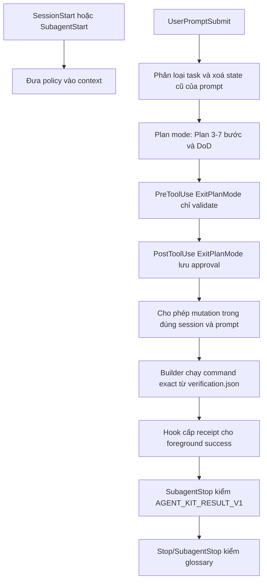

# agent-kit

Plugin điều phối subagent cho Claude Code, với ba cổng chính: kế hoạch phải được
duyệt trước mutation, kết quả kiểm chứng của `builder` phải có receipt có cấu
trúc, và định nghĩa token phải khớp glossary hoặc có citation local kiểm tra
được.

Phiên bản: **1.0.1**, nâng từ baseline **1.0.0**. Số hiệu này là lựa chọn có
chủ đích của maintainer và KHÔNG phản ánh mức thay đổi — `CHANGELOG.md` có mục
**Breaking** mà theo Semantic Versioning lẽ ra thuộc một major mới. Đọc mục
**Breaking** và **Migration** trước khi nâng cấp.

## Yêu cầu runtime

- Claude Code **2.1.196 trở lên**. Plugin cần `prompt_id` và `agent_id`: mutation
  epoch được scope theo project/session/prompt, còn receipt vẫn có owner là
  agent đã chạy verification.
- Python **3.9 trở lên**, có module stdlib `sqlite3` và executable tên
  `python3` trên `PATH`. Hook config gọi trực tiếp `python3`.
- Quyền tạo state riêng trong `${CLAUDE_PLUGIN_DATA}` hoặc `~/.claude`.

Repository có workflow cấu hình kiểm tra Ubuntu, macOS và Windows trên Python
3.9/3.13. Sau bước setup Python, mỗi job behavior chạy smoke test bằng đúng
executable và `args` khai trong `hooks/hooks.json`, rồi mới compile và chạy full
behavior tests. Workflow này chưa từng chạy trên GitHub trước bản 1.0.1, vì
vậy đây là ma trận CI đã cấu hình, không phải chứng nhận tương thích trên cả ba
hệ điều hành. Đặc biệt trên Windows, support có điều kiện: môi trường phải cung
cấp literal `python3` trên `PATH`; plugin không alias sang `python`.

## Cài đặt

Trong Claude Code:

```text
/plugin marketplace add nhattamgithub1999/agent-kit
/plugin install agent-kit@agent-kit
```

Hoặc từ terminal:

```bash
claude plugin marketplace add nhattamgithub1999/agent-kit
claude plugin install agent-kit@agent-kit
```

Khởi động lại phiên Claude Code sau khi cài hoặc nâng cấp để nạp lại agent và
hook.

## Luồng thực thi 1.0.1



Approval chỉ được tạo từ `PostToolUse` thành công của `ExitPlanMode`, khi
`tool_response.plan` có đúng một section `## Plan` gồm 3–7 bước đánh số liên tục
và đúng một section `## DoD` không rỗng. `PreToolUse ExitPlanMode` chỉ kiểm tra
format; `EnterPlanMode`, `TodoWrite`, `EnterWorktree` và việc ghi plan file không
tự mở gate. Approval được khóa theo cặp `(session_id, prompt_id)` và được dọn khi
prompt mới bắt đầu hoặc session kết thúc.

Trước approval, gate chặn `Edit`, `Write`, `NotebookEdit`, `Bash`, `PowerShell`,
`Monitor`, thao tác worktree và mọi tool khớp `mcp__.*`. Ngoại lệ duy nhất là
`Write` vào file plan bên trong thư mục plan-mode khi đang ở permission mode
`plan`. Ngoại lệ này dùng containment của filesystem native dưới thư mục
`~/.claude/plans` đã canonicalize: đường dẫn Windows dạng lexical không được
miễn trên POSIX; trên Windows, cross-drive, `..`, symlink/junction/reparse point
và parent thiếu hoặc không kiểm chứng được đều bị từ chối. Leaf mới chỉ được
phép khi parent thật đã tồn tại, không phải reparse point và vẫn nằm trong plan
root đã resolve.

## Sáu agent

| Agent | Trách nhiệm | Quyền chính |
|---|---|---|
| `Explore` | Tìm file, đọc và mô tả hiện trạng | Read-only |
| `architect` | Thiết kế, so sánh trade-off trước khi code | Read-only, có web |
| `verifier` | Đối chiếu claim của plan với codebase thật | Read-only |
| `builder` | Implement thay đổi đã có scope và DoD | Read/write/shell; không MCP, web hay spawn |
| `reviewer` | Review code, security, regression và test coverage | Read-only |
| `critic` | Phản biện logic của answer/plan độc lập với reasoning trace | Không dùng tool |

`reviewer` và `critic` không thay thế nhau: review có target code/file/repository
được route tới `reviewer`; phản biện answer, plan hoặc lập luận được route tới
`critic`. Prompt có yêu cầu sửa vẫn được route tới `builder` sau khi scope và DoD
đã rõ.

## Hook và wiring

Plugin có năm executable hook và một module dùng chung:

| File | Event chính | Trách nhiệm |
|---|---|---|
| `session-policy.py` | `SessionStart`, `SubagentStart` | Đưa `policy/delegation.md` vào context |
| `route-prompt.py` | `UserPromptSubmit` | Gắn route theo task; bỏ qua acknowledgement và mask write verb bị phủ định |
| `plan-gate.py` | `UserPromptSubmit`, tool events, `SessionEnd` | Quản lý approval theo prompt và chặn mutation chưa duyệt |
| `no-fake-pass.py` | mutation success/failure mọi actor; `SubagentStop` của builder | Tăng project epoch, ghi verification outcome và cấp/kiểm receipt |
| `gloss-gate.py` | `Stop`, `SubagentStop` | Kiểm định nghĩa explicit trong `last_assistant_message` |
| `_shared.py` | Được import bởi các hook | SQLite state, normalize, citation, log/dump riêng tư |

Các hook policy, routing và glossary **fail-open** khi payload hỏng hoặc thiếu dữ
liệu cần đọc. Glossary cũng bỏ qua ngay khi `stop_hook_active` (snake_case hoặc
camelCase) báo hook stop đang chạy lại, tránh tự chặn đệ quy. Plan gate
**fail-closed** cho mutation/approval đã nhận diện khi thiếu scope hoặc state an
toàn; lifecycle cleanup vẫn fail-open. No-fake nhận `PostToolUse` và
`PostToolUseFailure` của mọi mutation family từ mọi actor để làm stale evidence;
chỉ builder bare hoặc `agent-kit:builder` được cấp receipt từ exact verification
và bị kiểm `READY` ở `SubagentStop`. Lỗi contract, scope hoặc state sẽ chặn đường
liên quan, còn payload không parse được thì fail-open. `PLAN_GATE=off` và
`GLOSS_GATE=off` là bypass vận hành có chủ đích, không phải trạng thái an toàn
mặc định.

Routing xét write verb sau khi mask cụm phủ định gần như `không sửa`, `đừng sửa`
hoặc `do not edit`. Một positive write clause riêng vẫn route `BUILD`; khi cùng
clause còn chỉ dẫn read-only mâu thuẫn không thể phân giải, route là
`AMBIGUOUS`, không tự nâng thành `BUILD`.

## Bắt buộc: verification contract của project

Tạo `<project>/.claude/verification.json`. Nếu file đã tồn tại, phải parse và
merge schema hiện có; không append thêm JSON object và không overwrite mù command
riêng của project. Chạy lại cùng thao tác cấu hình với cùng input phải giữ nguyên
nội dung ngữ nghĩa. Gặp schema lạ hoặc conflict thì dừng để xác nhận.

Contract hiện tại của chính repository (đồng bộ với
`.claude/verification.json`):

```json
{
  "version": 1,
  "steps": {
    "build": {
      "command": "python3 -m compileall -q hooks tests",
      "cwd": "."
    },
    "typecheck": null,
    "lint": {
      "command": "python3 tests/static_check.py",
      "cwd": "."
    },
    "test": {
      "command": "python3 -m unittest discover -s tests -p 'test_*.py' -v",
      "cwd": "."
    }
  },
  "n_a_reasons": {
    "typecheck": "N/A: Python stdlib project chưa dùng static type checker"
  }
}
```

Contract phải có đúng ba field root `version`, `steps`, `n_a_reasons` và đúng
bốn step `build`, `typecheck`, `lint`, `test`. Step active có đúng `command` và
`cwd`; `cwd` phải resolve vào directory bên trong project. Mỗi cặp command/cwd
phải duy nhất. Step N/A dùng `null`, đồng thời có đúng một lý do không rỗng bắt
đầu bằng `N/A:` trong `n_a_reasons`. Không đổi step đang lỗi thành N/A.

Runtime hook và `tests/static_check.py` cùng gọi pure validator trong
`hooks/_shared.py`, nên verdict schema không được duy trì bằng hai bộ rule khác
nhau. Validator sắp step active theo thứ tự cố định
`build` → `typecheck` → `lint` → `test`, bỏ qua step N/A. Với contract của
repository này, chain thực tế là `build` → `lint` → `test`.

Builder chỉ nhận receipt khi command và cwd khớp chính xác contract hiện tại,
chạy foreground, không bị interrupt và hook nhận `PostToolUse`. Mỗi record gắn
với fingerprint của toàn contract hiện tại cùng exact command/cwd. Chạy lại một
step sẽ vô hiệu chính step đó và mọi step downstream; phải chạy tiếp phần còn lại
đúng thứ tự. Verification failure hoặc interrupted làm tăng epoch và xoá live
chain.

Verification chạy background không được cấp receipt và taint toàn prompt, kể cả
khi sau đó chạy lại đủ chain. Sau khi chờ background hoàn tất hoặc cancel nó,
phải gửi prompt mới rồi chạy lại chain; cùng prompt không thể báo `READY`.
Receipt được đưa vào context theo format:

```text
AGENT_KIT_RECEIPT_V1={"epoch":0,"receipt":"<opaque-value>","step":"build"}
```

Mutation epoch được khóa theo hash của canonical project path cùng session và
prompt; actor không nằm trong khóa epoch. Vì vậy mutation thành công hoặc thất
bại từ main, agent khác, shell, worktree hay MCP trong cùng project/session/prompt
đều làm receipt cũ stale. Receipt vẫn được bind với owner agent, nên builder khác
không thể dùng lại. Ngoài ra receipt còn bind với step, exact command/cwd,
verification contract và epoch; khác bất kỳ scope/fact nào trong số đó đều không
hợp lệ. Prose, output paste lại và code fence không được coi là evidence.

Builder phải kết thúc bằng đúng một dòng không nằm trong code fence. Khi đủ mọi
step active:

```text
AGENT_KIT_RESULT_V1={"status":"READY","receipts":{"build":"<receipt>","lint":"<receipt>","test":"<receipt>"}}
```

Khi chưa đạt:

```text
AGENT_KIT_RESULT_V1={"status":"NOT_READY","reason":"<lý do cụ thể>"}
```

Object `receipts` phải chứa đúng các step active; step N/A không xuất hiện.

## Glossary

Glossary người dùng ở `~/.claude/glossary.txt` là nguồn ưu tiên. Glossary project
ở `<project>/.claude/glossary.txt` chỉ được thêm token mới; nếu định nghĩa lại
token home với nghĩa khác, hook báo conflict.

Để khởi tạo mà không ghi đè file đã có, chạy từ root source repository:

```bash
mkdir -p ~/.claude
test -e ~/.claude/glossary.txt || cp glossary.example.txt ~/.claude/glossary.txt
```

Mỗi entry có dạng `TOKEN = nghĩa đã xác nhận`. Hook so sánh exact sau khi Unicode
NFC, case-fold và gộp whitespace; không bỏ dấu và không suy nghĩa từ chữ cái đầu.
Một định nghĩa chưa có trong glossary chỉ hợp lệ khi citation local `path:line`
resolve bên trong project và chính dòng đó chứa cả token lẫn nghĩa. Nếu chưa có
nguồn, giữ nguyên token và viết `[CHƯA RÕ: <token>]`.

## State, security và privacy

State mặc định nằm tại `${CLAUDE_PLUGIN_DATA}/agent-kit`; nếu runtime không cấp
biến đó, fallback là `~/.claude/agent-kit`. SQLite dùng transaction và WAL để
đồng bộ approval, project-scoped mutation epoch và verification record.

Internal schema hiện là v2. Khi mở database v1, migration chạy trong cùng
transaction: giữ `plan_approvals`, nhưng xoá và tạo lại mutation/verification
tables để receipt và mutation state v1 không thể được tái sử dụng. Nếu migration
lỗi, transaction rollback về v1 thay vì để database nửa cũ nửa mới.

Persistent state chỉ lưu hash domain-separated thay cho runtime ID, plan,
project/file path, command, cwd và receipt; raw IDs, paths, commands, receipts
hay secrets không được persist. Log có giới hạn kích thước và redact field nhạy
cảm. `DUMP` chỉ nên bật khi debug: snapshot được redact, giới hạn kích thước và
giữ tối đa một backup, nhưng vẫn là dữ liệu chẩn đoán cần bảo vệ.

Trên POSIX, thư mục state được ép mode `0700`, file state/log/dump `0600`; symlink
và file thuộc user khác bị từ chối. Trên nền tảng không có POSIX ownership/mode,
plugin không tuyên bố cung cấp cùng mức bảo vệ permission. Nếu `sqlite3` thiếu
hoặc state path không an toàn/không truy cập được, mutation và báo cáo `READY`
fail-closed.

## Biến môi trường đang hỗ trợ

| Biến | Mặc định | Tác dụng |
|---|---:|---|
| `ROUTE_MIN_CHARS` | `12` | Ngưỡng 0–4096; prompt ngắn hơn không được route |
| `PLAN_GATE` | bật | `off` tắt plan gate |
| `GLOSS_GATE` | `block` | `warn` chỉ log, `off` tắt gate |
| `GLOSS_MIN_LEN` | `3` | Độ dài token tối thiểu, được clamp 2–32 |
| `POLICY_HOOK` | bật | `off` tắt policy injection |
| `POLICY_FILE` | policy của plugin | Trỏ tới file policy UTF-8 khác |
| `DUMP` | tắt | Giá trị không rỗng bật diagnostic dump đã redact |
| `CLAUDE_PLUGIN_DATA` | fallback home | Root state do Claude Code cấp |
| `AGENT_KIT_SQLITE_BUSY_TIMEOUT_MS` | `3000` | SQLite busy timeout, clamp 50–4000 ms |
| `AGENT_KIT_LOG_MAX_BYTES` | `262144` | Giới hạn log, clamp 4096–4194304 byte |
| `AGENT_KIT_DUMP_MAX_BYTES` | `262144` | Giới hạn dump, clamp 4096–4194304 byte |
| `GLOSS_REPEAT_CAP` | `3` | Số lần chặn lặp lại tối đa trước khi gloss-gate cho qua, clamp 1–20 |

`CLAUDE_PLUGIN_ROOT` và `CLAUDE_PROJECT_DIR` là context path mà Claude Code/hook
dùng để tìm plugin hoặc project; chúng không phải feature toggle. Giá trị số sai
format được đưa về mặc định và clamp thay vì làm hook crash.

`AGENT_KIT_SQLITE_BUSY_TIMEOUT_MS` không phải trần thời gian chờ thực tế: SQLite
chỉ dùng nó cho một khoản ngân sách nhỏ, còn phần chờ chính khi lock bị giữ được
cưỡng chế bằng deadline đo theo đồng hồ đơn điệu trong Python, theo
`hooks/_shared.py:87-99`.

## Tự kiểm repository

Chạy từ root:

```bash
python3 -m compileall -q hooks tests
python3 tests/static_check.py
python3 -m unittest discover -s tests -p 'test_*.py' -v
claude plugin validate . --strict
claude plugin validate .claude-plugin/plugin.json --strict
claude plugin validate agents --strict
claude plugin validate skills --strict
```

Project hiện không cấu hình static type checker; step `typecheck` được khai N/A
có lý do trong `.claude/verification.json`. `tests/static_check.py` kiểm syntax,
JSON, file `.pyc` bị track nhầm, đồng bộ tên và version giữa hai manifest, gọi
cùng verification validator với runtime, và chạy bốn strict validation ở trên;
lệnh direct vẫn được liệt kê để dễ chẩn đoán từng validator. Nó KHÔNG kiểm
author hay release contract — hai thứ đó nằm ở `tests/test_release_contract.py`,
chỉ chạy ở job `behavior`, không chạy ở job strict validation.

Workflow `.github/workflows/ci.yml` cấu hình exact launcher smoke trước full
behavior tests trên ba hệ điều hành, cùng strict validation trên Ubuntu với
Claude Code được pin. Đây chỉ là cấu hình trong repository; CI remote cho 1.0.1
**CHƯA VERIFY**.

## Giới hạn đã biết

- Gate là kiểm soát protocol và contract, không phải chứng minh định lượng rằng
  agent giảm hallucination, defect hay chi phí trên workload thực. Các outcome
  đó chưa được đo.
- Malformed payload có thể fail-open ở policy, routing, glossary và ở điểm vào
  chưa xác định được event của các hook khác.
- Receipt dựa trên foreground `PostToolUse`; plugin không coi transcript, prose
  hay output được paste lại là bằng chứng thực thi.
- Exact command/cwd giúp tránh nhận nhầm evidence nhưng yêu cầu project giữ
  verification contract đồng bộ khi đổi script hoặc working directory.
- Glossary chỉ kiểm định nghĩa explicit mà parser nhận diện; nó không phải bộ
  phân tích ngữ nghĩa tổng quát.
- CI đa nền tảng mới được cấu hình, chưa có remote run để xác nhận toàn bộ ma
  trận. Performance và tác động chất lượng end-to-end cũng chưa có số đo.

## Đóng góp

`main` là branch được bảo vệ; thay đổi đi qua pull request. Trước khi mở PR, chạy
toàn bộ lệnh ở mục Tự kiểm và đính kèm output thật hoặc ghi rõ `CHƯA VERIFY` cho
lệnh chưa chạy được.

## Tác giả

Phát triển tại **Phòng ISCSU2**. Người phát triển: **TamBN3** —
**tambn3@fpt.com**.

## Giấy phép

MIT. Xem `LICENSE`.
