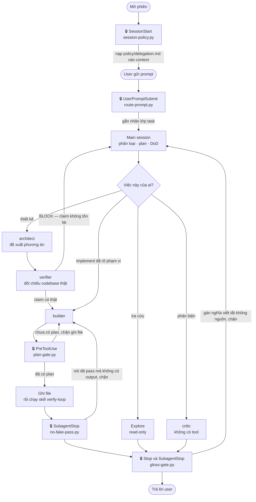

# agent-kit

Plugin cho Claude Code, gồm một bộ subagent và một vòng kiểm chứng. Mục đích là
buộc agent làm việc theo ba nguyên tắc:

- **Không bịa.** Mọi khẳng định phải có nguồn thật. Chỗ nào không tra được thì
  phải hiện ra là chưa rõ, không được lấp cho câu văn liền mạch.
- **Có mục tiêu.** Mỗi task phải có tiêu chí hoàn thành kiểm chứng được, và phải
  có điều kiện dừng để không lặp vô hạn.
- **Review lại.** Việc làm xong phải đi qua vòng verify (build, typecheck, lint,
  test) và qua cổng phản biện.

Phiên bản: **v1.0**. Profile: THOROUGH (siết chặt nhất).

## Cài đặt

Trong một phiên Claude Code:

```
/plugin marketplace add nhattamgithub1999/agent-kit
/plugin install agent-kit@agent-kit
```

Hoặc từ terminal:

```bash
claude plugin marketplace add nhattamgithub1999/agent-kit
claude plugin install agent-kit@agent-kit
```

Cài xong cần khởi động lại phiên để Claude Code nạp agent và hook.

## Nó giải quyết vấn đề gì

Năm kiểu sai mà một agent lập trình hay mắc, và trong bộ kit này mỗi kiểu có một
chốt chặn riêng:

| Kiểu sai | Trông như thế nào | Chốt chặn |
|---|---|---|
| Báo cáo khống | "Đã sửa xong, test pass hết" — nhưng chưa chạy lệnh test nào | `no-fake-pass.py` chặn lượt trả về nếu không kèm output thật |
| Nhảy vào code | Sửa file ngay từ câu đầu, chưa ai biết "xong" nghĩa là gì | `plan-gate.py` chặn lệnh ghi file khi phiên chưa có plan |
| Lấp nghĩa viết tắt | Gặp một từ viết tắt nghiệp vụ lạ rồi tự suy nghĩa từ chữ cái đầu | `gloss-gate.py` đối chiếu chữ cái đầu và glossary đã duyệt |
| Bỏ qua quy trình | Policy nằm trong `CLAUDE.md` ở quá xa nên lượt đầu quên mất | `session-policy.py` và `route-prompt.py` đưa policy vào đúng chỗ, đúng lúc |
| Làm hết một mình | Main session tự grep, tự đọc, tự sửa; context loãng dần rồi bắt đầu đoán | Policy buộc delegate; năm subagent mỗi cái một việc, mỗi cái một context sạch |

Điểm chung của cả năm: chúng **không** phải lời khuyên viết trong prompt. Prompt
chỉ làm giảm xác suất. Bốn hook ở trên chặn thật bằng exit code, nên chúng là ràng
buộc chứ không phải khuyến nghị.

## Luồng chạy bên trong plugin

Đây là vòng đời của một lượt làm việc. Ô có ổ khoá là hook — tức là chỗ plugin can
thiệp thật vào runtime, không phải chỗ nhắc nhở bằng chữ.



Đọc sơ đồ theo ba tầng:

1. **Trước khi nghĩ.** `session-policy.py` và `route-prompt.py` bảo đảm policy và
   nhãn phân loại có mặt trước khi agent kịp làm gì.
2. **Trước khi sửa.** `plan-gate.py` giữ cửa ghi file. `verifier` giữ cửa vào
   `builder`: phương án nào dựa trên hàm hoặc bảng không tồn tại thì không được
   giao cho ai implement.
3. **Trước khi trả lời.** `no-fake-pass.py` và `gloss-gate.py` soi nội dung lượt
   trả về, chặn hai loại nói quá phổ biến nhất.

## Bên trong có gì

| Thành phần | Nội dung |
|---|---|
| `agents/` | Năm subagent: `Explore` (haiku), `architect` và `critic` (opus), `builder` và `verifier` (sonnet) |
| `hooks/` | Năm hook Python, xem bảng ở mục dưới |
| `skills/verify-loop/` | Skill chạy vòng verify: build, typecheck, lint, test |
| `policy/delegation.md` | Khối policy được đưa vào context mỗi phiên |
| `VERIFICATION.template.md` | Mẫu để khai lệnh build/test của từng project |
| `glossary.example.txt` | File mẫu cho `gloss-gate` |
| `optional/orchestrator.md` | Bản thay thế system prompt. Không bật mặc định |

### Năm subagent, mỗi cái một việc

| Agent | Dùng khi | Không dùng để |
|---|---|---|
| `Explore` | Tra cứu, tìm file, đọc hiểu hiện trạng | Sửa file, ra quyết định thiết kế |
| `architect` | Đề xuất phương án, so sánh trade-off | Tự sửa code |
| `builder` | Implement một thay đổi đã rõ phạm vi | Việc còn mơ hồ, hoặc cần quyết kiến trúc |
| `verifier` | Đối chiếu từng claim với codebase thật | Phản biện logic |
| `critic` | Phản biện độ chặt của lập luận | Sửa code |

Hai agent cuối là hai cổng chất lượng **khác nhau**, đừng dùng thay nhau.
`verifier` trả lời câu hỏi "thứ này có tồn tại không" nên nó có tool để đọc
codebase. `critic` trả lời câu hỏi "lập luận có chặt không" nên nó **không** có
tool, và chỉ được xem câu hỏi gốc cùng câu trả lời chứ không xem quá trình suy
luận — đó là điều giữ cho nó độc lập.

### Năm hook, năm chốt tất định

Prompt chỉ làm giảm xác suất agent làm sai. Hook mới là thứ chặn thật, bằng exit
code.

| Hook | Chạy lúc | Chặn cái gì |
|---|---|---|
| `session-policy.py` | Mở phiên | Policy bị bỏ qua vì plugin không đọc được `CLAUDE.md` |
| `route-prompt.py` | Người dùng gửi prompt | Lượt đầu của phiên đi thẳng vào việc, bỏ qua bước phân loại và lập plan |
| `plan-gate.py` | Trước khi ghi file | Nhảy vào sửa code khi chưa có plan |
| `no-fake-pass.py` | `builder` kết thúc | Báo "đã pass" mà không kèm lệnh đã chạy và output thật |
| `gloss-gate.py` | Agent kết thúc lượt | Tự gán nghĩa cho từ viết tắt hoặc thuật ngữ nghiệp vụ |

Cả năm đều **fail-open**: khi không đọc được dữ liệu đầu vào thì trả `exit 0`,
tức là không chặn. Thà bỏ lọt còn hơn chặn oan rồi làm nghẽn phiên làm việc.

## Policy: đưa vào context bằng cách nào

Plugin của Claude Code **không** nạp `CLAUDE.md` đặt ở gốc plugin
([tài liệu](https://code.claude.com/docs/en/plugins-reference)). Vì vậy khối
policy không thể đi theo đường đó.

Thay vào đó, hook `session-policy.py` đọc file `policy/delegation.md` rồi trả nội
dung về qua `hookSpecificOutput.additionalContext` ở event `SessionStart`. Muốn
sửa policy thì sửa đúng file đó, vì không có bản copy nào khác trong repo.

Tài liệu chính thức không nói rõ `SessionStart` có nhận `additionalContext` hay
không, nên điều này đã được kiểm bằng thực nghiệm có đối chứng: đặt một chuỗi
canary chỉ tồn tại trong file policy, rồi so sánh phiên có bật hook với phiên
`POLICY_HOOK=off`. Phiên bật hook đọc được canary, phiên tắt hook thì không.

## Một bước bắt buộc cho từng project

```bash
cat VERIFICATION.template.md >> <project>/.claude/CLAUDE.md
```

Sau đó điền lệnh build, typecheck, lint và test **thật** của project đó. Bỏ bước
này thì agent phải tự suy đoán lệnh, và như vậy là mất luôn nguyên tắc không bịa.

## Glossary — nên làm ngay

```bash
cp glossary.example.txt ~/.claude/glossary.txt
```

Rồi điền dần vào đó, mỗi dòng một cặp `VIẾTTẮT = nghĩa chính thức`.

Với những token có trong file này, `gloss-gate` đối chiếu trực tiếp nghĩa mà
agent viết ra với nghĩa chính thức bạn đã khai. Mâu thuẫn là chặn ngay, không cần
suy luận gì thêm. Đây là tín hiệu mạnh nhất mà hook có.

Chỉ thêm một dòng khi bạn **đã xác nhận** nghĩa của nó. Một dòng sai ở đây sẽ hợp
thức hoá đúng loại lỗi mà file này sinh ra để chặn.

## Điều chỉnh bằng biến môi trường

Plugin không có cách khai báo biến môi trường
([tài liệu](https://code.claude.com/docs/en/plugins-reference)), nên các hook dùng
giá trị mặc định của profile THOROUGH. Muốn đổi thì `export` trong shell trước khi
chạy `claude`.

| Biến | Mặc định | Tác dụng |
|---|---|---|
| `ROUTE_MIN_CHARS` | 12 | Prompt ngắn hơn ngưỡng này thì không phân loại |
| `PLAN_GATE_FREE_EDITS` | 0 | Số lần ghi file được miễn trước khi gate bắt đầu chặn |
| `PLAN_GATE` | — | Đặt `off` để tắt plan gate |
| `PLAN_GATE_PLAN_TOOLS` | — | Thêm tool được tính là "đã có plan", cách nhau bằng dấu phẩy |
| `NOFAKEPASS_AGENTS` | `builder` | Agent nào bị soi khi khẳng định "đã pass" |
| `NOFAKEPASS_STRICT` | — | Đặt `1` để chặn cả khi không nhận diện được agent nào đang chạy |
| `GLOSS_GATE` | `block` | `warn` là chỉ ghi log, `off` là tắt hẳn |
| `GLOSS_MIN_LEN` | 3 | Độ dài tối thiểu của viết tắt mới bị soi |
| `POLICY_HOOK` | — | Đặt `off` để không đưa policy vào context |
| `POLICY_FILE` | — | Trỏ tới file policy khác |

## Hiệu quả: đo được gì, chưa đo được gì

Phần này viết theo đúng nguyên tắc mà bộ kit đòi ở agent — số nào có thì nói, số
nào chưa có thì nói là chưa có.

### Đo được, và bạn tự chạy lại được ngay

| Chạy cái này | Ra cái này | Nó chứng minh gì |
|---|---|---|
| `claude plugin validate . --strict` | Validation passed, không warning | Manifest, hook config và frontmatter của cả 5 agent đều đúng schema |

Đó là lệnh duy nhất bạn kiểm lại được từ bản phát hành này.

### Đo được, nhưng bạn phải tin tôi

Hai số dưới đây đo bằng `kit-selfcheck.py`, script kiểm cấu hình nội bộ **không
đóng gói kèm plugin**:

| Số đo nội bộ | Kết quả | Nó chứng minh gì |
|---|---|---|
| 145 check ngữ nghĩa cấu hình | PASS 145, FAIL 0 | 145 ràng buộc về **giá trị** cấu hình đang đúng: model tier từng agent, ngưỡng số, tool nào bị cấm, và tính nhất quán chéo giữa các file |
| Đối chứng âm: tiêm 30 defect | Bắt 30/30 | Validator bị tiêm 30 lỗi thật rồi phải bắt đủ 30 — nó không phải loại luôn báo pass |

Số thứ hai đáng tin hơn số thứ nhất, vì một validator luôn nói "ổn" thì vô dụng,
mà chỉ có đối chứng âm mới phân biệt được hai loại đó.

Nhưng cả hai đều là số **tôi báo lại**, không phải số bạn kiểm lại được từ repo
này. Hãy đọc chúng đúng ở mức đó. Bản ghi đo nội bộ trước khi đóng gói ở mức 141
check và 28/28 defect; con số hiện tại cao hơn vì mỗi lỗi tìm được trong quá trình
đóng gói thành plugin đều được thêm một check để nó không tái diễn. Bản ghi đó giữ
nguyên số cũ — sửa số trong một bản ghi đo là đúng loại việc mà bộ kit này tồn tại
để chặn.

### Gate có bắn thật không — sổ ghi từ chính lúc làm repo này

Bốn lần bị chặn thật, tất cả đều nằm trong git log:

| Bị chặn ở đâu | Đúng hay oan | Xử lý |
|---|---|---|
| `plan-gate` chặn lệnh ghi file khi phiên chưa có plan | Đúng | Không nới gate. Ba đường thoát nó nêu ra đều dùng được |
| `gloss-gate` chặn vì token có gạch nối bị tách sai | Oan | Sửa: dấu gạch nối phải có khoảng trắng hai bên |
| `gloss-gate` chặn chính dòng phân loại mà policy bắt buộc phải in | Oan, và là tự mâu thuẫn | Sửa: thêm danh sách từ vựng của chính kit vào diện bỏ qua |
| `gloss-gate` chặn vì toán tử so sánh bị coi là dấu gán nghĩa | Oan | Sửa: dấu gán phải đứng độc lập, không phải phần của `==`, `=>`, `!=` |

Ba lần oan đều đã thành fix kèm test hồi quy. Điều này nói lên hai chuyện: gate
thật sự cắn, kể cả cắn người viết ra nó; và mỗi lần cắn oan đều bị siết lại chứ
không bị nới ra cho dễ chịu.

### Chưa đo được — và tại sao chưa

Bản ghi đo nội bộ khai thẳng những chỉ số **chưa có số**: tỉ lệ bịa, tỉ lệ defect
lọt lưới, tỉ lệ có plan, tỉ lệ delegate, tổng chi phí, và tỉ lệ chặn oan trên task
nhỏ. Lý do ghi trong đó: không có baseline thì con số đo sau vô nghĩa.

Vì vậy đừng đọc bộ kit này như một thứ đã được chứng minh làm giảm tỉ lệ bịa bao
nhiêu phần trăm. Cái đo được là **cấu hình đúng như thiết kế** và **cơ chế chặn có
hoạt động**. Cái chưa đo được là **kết quả cuối trên việc thật**.

Bản ghi đó còn nói rõ một điều mà tài liệu quảng cáo thường bỏ qua: khi so hai
phiên bản mà chỉ có số đo tĩnh, kết luận duy nhất rút ra được là bản mới **đắt
hơn**, chứ không phải tốt hơn.

### Chi phí đã biết

| Khoản | Lượng | Ghi chú |
|---|---|---|
| Khối policy | 73 dòng, 3.886 ký tự, một lần mỗi phiên | Vào context ở `SessionStart`, không phải mỗi lượt |
| Nhãn phân loại | Khoảng 60–130 token mỗi lượt | Theo ghi chú trong `hooks/route-prompt.py` |
| Bốn hook chặn | Không tốn token | Chúng chỉ đọc payload và trả exit code |

Quy đổi ký tự sang token dùng ước lượng 3,5 ký tự một token cho văn bản Việt–Anh
trộn. Đó là **ước lượng**, không phải đo bằng tokenizer thật: con số ký tự là đếm
được, con số token thì không.

## Những giới hạn đã biết

**`gloss-gate` chặn cả việc viết *về* chuyện gán nghĩa sai.** Nếu tài liệu, test
hay báo cáo của bạn trích nguyên một cặp viết-tắt kèm nghĩa sai để làm ví dụ, hook
vẫn chặn, vì nó không phân biệt được "đang khẳng định" với "đang trích dẫn". Đây
là lựa chọn có ý thức: cách sửa tự nhiên nhất là miễn trừ nội dung trong backtick,
nhưng làm vậy thì chỉ cần bọc backtick là lách được gate. Khi cần viết loại nội
dung đó, dùng `GLOSS_GATE=warn` cho lượt đó.

**`no-fake-pass` chỉ nhận bằng chứng ở ba dạng:** block code, dòng bắt đầu bằng
`$ <lệnh>`, hoặc câu ghi rõ `CHƯA VERIFY`. Nhắc tên lệnh bằng inline backtick
không được tính là bằng chứng.

**Policy có tới được subagent hay không thì CHƯA VERIFY.** Hook chạy ở
`SessionStart`, và điều đã kiểm được là nó tới được phiên chính. Subagent là một
context riêng, nên rất có thể nó không nhận khối policy này — khác với bản cài thủ
công, nơi `CLAUDE.md` tới được mọi agent. Bù lại, các luật cốt lõi đã được viết
thẳng vào từng file trong `agents/`, nên subagent không đi làm mà tay trắng. Dù
vậy đây vẫn là điều chưa đo, không phải điều đã bảo đảm.

**Mọi số đo của kit đều là kiểm tĩnh.** Chúng đo cấu hình có đúng hay không, chứ
không đo được agent có thật sự ngừng bịa hay không.

## Tự kiểm

```bash
claude plugin validate . --strict   # manifest và component của plugin
```

Bộ kiểm ngữ nghĩa 145 check và đối chứng âm 30 defect là công cụ nội bộ, không
phát hành kèm plugin. Kết quả của chúng ghi ở mục Hiệu quả bên trên.

## Đóng góp

`main` là branch được bảo vệ, mọi thay đổi đi qua pull request. Trước khi mở PR,
chạy lệnh ở mục Tự kiểm và dán output vào phần mô tả.

## Tác giả

Phát triển tại **Phòng ISCSU2**. Người phát triển: **TamBN3** — tambn3@fpt.com.

Báo lỗi hoặc góp ý thì mở issue trên repo, kèm output của lệnh ở mục Tự kiểm.

## Giấy phép

MIT. Xem file `LICENSE`.
